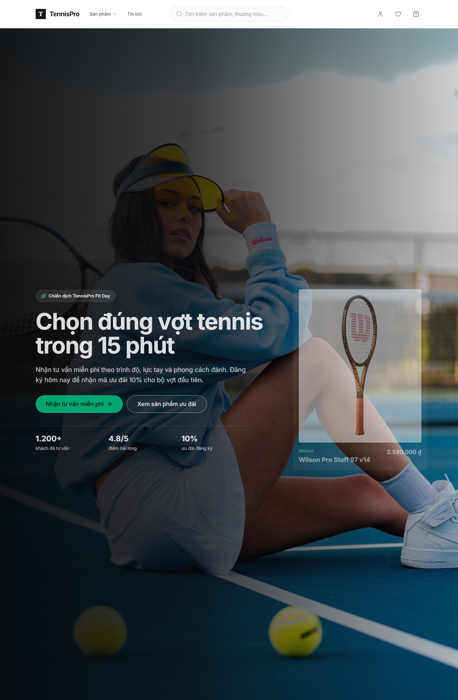

# BÁO CÁO ĐỒ ÁN: THIẾT KẾ LANDING PAGE QUẢNG CÁO TENNISPRO

## Mục lục

1. Mở đầu
2. Tên đề tài
3. Lý do chọn đề tài
4. Cơ sở lý thuyết về landing page
5. Mục tiêu của đồ án
6. Đối tượng người dùng
7. Phân tích yêu cầu landing page
8. Thiết kế cấu trúc landing page
9. Hành trình người dùng
10. Giải thích mã nguồn landing page, gồm code và ý nghĩa từng đoạn
11. Đánh giá landing page
12. Hướng phát triển
13. Kết luận
14. Đối chiếu và bổ sung theo yêu cầu chương 3

## 1. Mở đầu

Trong hoạt động kinh doanh trực tuyến, landing page là một công cụ quan trọng giúp doanh nghiệp triển khai các chiến dịch quảng cáo, giới thiệu sản phẩm và thu thập thông tin khách hàng tiềm năng. Khác với website thông thường có nhiều trang và nhiều mục đích sử dụng, landing page được thiết kế tập trung vào một mục tiêu cụ thể, thường là đăng ký tư vấn, mua hàng, tải tài liệu hoặc để lại thông tin liên hệ.

Đồ án này thực hiện việc thiết kế và xây dựng landing page cho thương hiệu TennisPro. Nội dung landing page tập trung vào chiến dịch tư vấn chọn vợt tennis phù hợp với trình độ và phong cách chơi của khách hàng. Mục tiêu chính của trang là thu hút người truy cập, truyền tải thông điệp rõ ràng và khuyến khích khách hàng để lại thông tin để được tư vấn.

## 2. Tên đề tài

**Thiết kế landing page quảng cáo cho chiến dịch tư vấn chọn vợt tennis của TennisPro**

Landing page được xây dựng với thông điệp trung tâm:

```text
Chọn đúng vợt tennis trong 15 phút
```

Thông điệp này hướng đến nhu cầu thực tế của người chơi tennis: muốn tìm được cây vợt phù hợp nhưng chưa hiểu rõ các thông số kỹ thuật hoặc chưa biết sản phẩm nào phù hợp với bản thân.

## 3. Lý do chọn đề tài

Tennis là môn thể thao đòi hỏi người chơi sử dụng dụng cụ phù hợp, đặc biệt là vợt tennis. Một cây vợt phù hợp có thể giúp người chơi kiểm soát bóng tốt hơn, giảm mỏi tay, tăng lực đánh và cải thiện hiệu quả thi đấu. Tuy nhiên, nhiều khách hàng khi mua vợt thường gặp khó khăn vì sản phẩm có nhiều thông số kỹ thuật như trọng lượng, kích thước mặt vợt, điểm cân bằng, chất liệu khung và kích cỡ tay cầm.

Nếu khách hàng tự chọn sản phẩm mà không được tư vấn, họ có thể mua sai loại vợt, dẫn đến trải nghiệm không tốt và giảm khả năng quay lại mua hàng. Vì vậy, việc xây dựng một landing page chuyên biệt cho chiến dịch tư vấn chọn vợt là cần thiết.

Landing page TennisPro được thiết kế nhằm giải quyết các vấn đề sau:

- Giúp khách hàng hiểu lợi ích của việc chọn đúng vợt tennis.
- Tạo một điểm đến rõ ràng cho các chiến dịch quảng cáo.
- Thu thập thông tin khách hàng có nhu cầu thật.
- Hỗ trợ doanh nghiệp chuyển đổi người truy cập thành khách hàng tiềm năng.
- Tăng hiệu quả truyền thông và bán hàng cho sản phẩm tennis.

## 4. Cơ sở lý thuyết về landing page

Landing page là một trang web độc lập được tạo ra cho một chiến dịch marketing cụ thể. Người dùng thường truy cập landing page thông qua quảng cáo, email, mạng xã hội hoặc công cụ tìm kiếm. Mục tiêu của landing page là dẫn dắt người dùng thực hiện một hành động cụ thể.

Một landing page hiệu quả thường có các thành phần chính:

- Tiêu đề rõ ràng, thể hiện đúng lợi ích chính.
- Hình ảnh hoặc video liên quan trực tiếp đến sản phẩm, dịch vụ.
- Nội dung ngắn gọn, tập trung vào vấn đề và giải pháp.
- Lời kêu gọi hành động nổi bật.
- Form đăng ký hoặc nút chuyển đổi.
- Bằng chứng tạo niềm tin như đánh giá, số liệu, cam kết.
- Câu hỏi thường gặp để giải đáp thắc mắc của khách hàng.

Trong đồ án này, landing page TennisPro được xây dựng theo đúng định hướng trên. Trang không trình bày quá nhiều thông tin rời rạc mà tập trung vào một mục tiêu chính: khách hàng để lại thông tin để được tư vấn chọn vợt.

## 5. Mục tiêu của đồ án

Đồ án hướng đến việc xây dựng một landing page có tính ứng dụng thực tế, phù hợp với hoạt động quảng cáo của một cửa hàng tennis.

Các mục tiêu cụ thể gồm:

- Thiết kế landing page có giao diện hiện đại, rõ ràng và phù hợp với lĩnh vực tennis.
- Xây dựng nội dung quảng cáo tập trung vào lợi ích của khách hàng.
- Tạo form thu thập thông tin khách hàng tiềm năng.
- Mô phỏng quy trình chuyển đổi từ người truy cập thành lead.
- Trình bày sản phẩm gợi ý để tăng tính thuyết phục.
- Đảm bảo landing page có thể hiển thị tốt trên nhiều kích thước màn hình.

## 6. Đối tượng người dùng

Landing page TennisPro hướng đến các nhóm người dùng sau:

- Người mới bắt đầu chơi tennis và cần được tư vấn chọn vợt.
- Người chơi trung cấp muốn nâng cấp vợt phù hợp hơn với kỹ thuật hiện tại.
- Người chơi nâng cao quan tâm đến thông số kỹ thuật của sản phẩm.
- Khách hàng đang phân vân giữa nhiều dòng vợt khác nhau.
- Người truy cập đến từ quảng cáo và có nhu cầu tìm hiểu sản phẩm nhanh chóng.

## 7. Phân tích yêu cầu landing page

### 7.1. Yêu cầu về nội dung

Landing page cần truyền tải được thông điệp ngắn gọn, dễ hiểu và có khả năng thuyết phục người dùng. Nội dung không nên dàn trải như một website giới thiệu doanh nghiệp mà cần đi thẳng vào nhu cầu của khách hàng.

Các nội dung cần có:

- Thông điệp chính của chiến dịch.
- Lợi ích khi đăng ký tư vấn.
- Các vấn đề khách hàng gặp phải khi chọn vợt.
- Quy trình tư vấn sau khi để lại thông tin.
- Sản phẩm gợi ý.
- Câu hỏi thường gặp.
- Lời kêu gọi hành động ở các vị trí quan trọng.

### 7.2. Yêu cầu về giao diện

Giao diện cần tạo cảm giác chuyên nghiệp, rõ ràng và phù hợp với sản phẩm thể thao. Landing page sử dụng hình ảnh liên quan đến tennis để tạo sự kết nối trực tiếp với sản phẩm.

Các yêu cầu giao diện:

- Bố cục rõ ràng, dễ theo dõi.
- Tiêu đề nổi bật, dễ đọc.
- Nút CTA có màu sắc nổi bật.
- Form đăng ký gọn, không hỏi quá nhiều thông tin.
- Các phần nội dung có khoảng cách hợp lý.
- Hiển thị tốt trên cả máy tính và thiết bị di động.

### 7.3. Yêu cầu về chuyển đổi

Landing page phải hướng người dùng đến hành động chính là để lại thông tin tư vấn. Vì vậy, các yếu tố như tiêu đề, nội dung lợi ích, quy trình và CTA đều được sắp xếp nhằm tăng khả năng chuyển đổi.

Form thu thập thông tin gồm:

- Họ và tên.
- Số điện thoại.
- Email.
- Trình độ chơi tennis.
- Nhu cầu chính khi chọn vợt.

## 8. Thiết kế cấu trúc landing page

Landing page TennisPro được chia thành nhiều section theo hành trình ra quyết định của khách hàng.

### 8.1. Hero section

Hero section là phần đầu tiên xuất hiện khi người dùng truy cập trang. Đây là khu vực quan trọng nhất vì quyết định người dùng có tiếp tục ở lại trang hay không.

Nội dung hero section gồm:

- Tên chiến dịch: **TennisPro Fit Day**.
- Tiêu đề: **Chọn đúng vợt tennis trong 15 phút**.
- Mô tả ngắn về lợi ích của việc đăng ký tư vấn.
- Nút CTA chính: **Nhận tư vấn miễn phí**.
- Nút phụ: **Xem sản phẩm ưu đãi**.
- Các chỉ số tạo niềm tin như số lượng khách đã tư vấn, điểm hài lòng và mức ưu đãi.

Hero section sử dụng hình ảnh nền liên quan đến tennis để tạo ấn tượng trực quan và giúp người dùng nhận biết ngay chủ đề của trang.

### 8.2. Form thu thập thông tin

Form là thành phần quan trọng nhất của landing page vì đây là nơi tạo ra chuyển đổi. Khi người dùng điền form, thông tin được lưu lại để mô phỏng quá trình thu thập khách hàng tiềm năng.

Dữ liệu form được lưu vào localStorage với key:

```text
tennis-leads
```

Cấu trúc dữ liệu lead gồm:

```ts
{
  id: string;
  name: string;
  phone: string;
  email: string;
  level: string;
  interest: string;
  createdAt: string;
}
```

Trong đó:

- `id` là mã định danh của lead.
- `name` là họ tên khách hàng.
- `phone` là số điện thoại liên hệ.
- `email` là email của khách hàng.
- `level` là trình độ chơi tennis.
- `interest` là nhu cầu chính khi chọn vợt.
- `createdAt` là thời gian khách hàng gửi form.

### 8.3. Phần lợi ích

Phần lợi ích giúp người dùng hiểu rõ giá trị nhận được khi đăng ký tư vấn. Nội dung tập trung vào ba lợi ích chính:

- Được tư vấn đúng theo lối chơi.
- Nhận mã ưu đãi dành riêng cho landing page.
- Mua sản phẩm chính hãng, có cam kết và bảo hành.

Phần này giúp tăng sự tin tưởng và tạo động lực để khách hàng hoàn thành form.

### 8.4. Phần nêu vấn đề

Landing page chỉ ra các vấn đề phổ biến khi khách hàng tự chọn vợt tennis:

- Chọn sai trọng lượng vợt khiến người chơi nhanh mỏi tay.
- Chọn sai kích thước mặt vợt làm giảm khả năng kiểm soát bóng.
- Chọn sai grip size gây cảm giác cầm không chắc và ảnh hưởng cổ tay.

Việc nêu vấn đề giúp khách hàng nhận ra nhu cầu của chính mình, từ đó tăng khả năng họ đăng ký tư vấn.

### 8.5. Phần quy trình hoạt động

Quy trình tư vấn được trình bày theo 4 bước:

1. Khách hàng để lại thông tin.
2. Chuyên viên gọi xác nhận nhu cầu.
3. Khách hàng nhận gợi ý vợt và mã ưu đãi.
4. Khách hàng đặt hàng hoặc tiếp tục xem sản phẩm phù hợp.

Phần này giúp khách hàng hiểu rõ điều gì sẽ xảy ra sau khi họ gửi form. Điều này làm giảm sự lo ngại khi cung cấp thông tin cá nhân.

### 8.6. Phần sản phẩm gợi ý

Landing page hiển thị một số sản phẩm nổi bật để tăng tính thực tế cho chiến dịch. Mục tiêu của phần này không phải thay thế trang bán hàng mà là hỗ trợ người dùng hình dung được các lựa chọn có thể được tư vấn.

Phần sản phẩm gợi ý giúp:

- Tạo sự tin tưởng vì trang có sản phẩm cụ thể.
- Giúp khách hàng quan tâm hơn đến nội dung tư vấn.
- Tạo đường dẫn tiếp tục sang trang sản phẩm nếu khách hàng đã sẵn sàng mua.

### 8.7. Phần câu hỏi thường gặp

FAQ được sử dụng để giải đáp những thắc mắc có thể khiến khách hàng chưa muốn điền form.

Các câu hỏi chính:

- Tư vấn có mất phí không?
- Mã giảm giá dùng như thế nào?
- Chưa biết thông số vợt thì có đăng ký được không?

Phần FAQ giúp giảm rào cản tâm lý và tăng khả năng chuyển đổi.

### 8.8. CTA cuối trang

Ở cuối landing page có một lời kêu gọi hành động cuối cùng. Đây là điểm nhắc lại mục tiêu chính của trang sau khi người dùng đã đọc đủ thông tin.

CTA cuối trang giúp người dùng ra quyết định nhanh hơn và tăng khả năng hoàn thành form.

## 9. Hành trình người dùng

Hành trình người dùng trên landing page được thiết kế như sau:

1. Người dùng truy cập landing page từ quảng cáo hoặc đường link.
2. Người dùng nhìn thấy thông điệp chính ở hero section.
3. Người dùng nhấn nút **Nhận tư vấn miễn phí**.
4. Trang tự cuộn đến form đăng ký.
5. Người dùng điền thông tin cá nhân và nhu cầu.
6. Hệ thống lưu thông tin vào localStorage.
7. Người dùng nhận thông báo đăng ký thành công.
8. Doanh nghiệp có thể dùng thông tin này để liên hệ tư vấn.

Hành trình này thể hiện đúng nguyên tắc hoạt động của một landing page: thu hút, thuyết phục và chuyển đổi.

## 10. Giải thích mã nguồn landing page

Phần landing page chính được xây dựng trong file:

```text
src/pages/Home.tsx
```

Đây là file chịu trách nhiệm hiển thị toàn bộ trang chủ dạng landing page, bao gồm hero section, form thu lead, phần lợi ích, phần nêu vấn đề, quy trình chuyển đổi, sản phẩm gợi ý, FAQ và CTA cuối trang.

### 10.1. Import thư viện và component cần dùng

```tsx
import React, { useMemo, useRef, useState } from 'react';
import { Link, useNavigate } from 'react-router-dom';
import {
  ArrowRight,
  BadgePercent,
  CheckCircle2,
  ChevronDown,
  Clock3,
  HeadphonesIcon,
  ShieldCheck,
  Sparkles,
  Star,
  Trophy,
} from 'lucide-react';
import { motion } from 'motion/react';
import { useProduct } from '../context/ProductContext';
import { useToast } from '../context/ToastContext';
import { Button } from '../components/ui/Button';
import { Input } from '../components/ui/Input';
import { ProductGrid } from '../components/product/ProductGrid';
import { formatPrice } from '../utils/format';
```

Đoạn code trên khai báo các thư viện và component được sử dụng trong landing page.

- `useMemo` dùng để lọc và ghi nhớ danh sách sản phẩm nổi bật, tránh tính toán lại không cần thiết.
- `useRef` dùng để tham chiếu đến khu vực form, phục vụ chức năng cuộn đến form khi người dùng bấm CTA.
- `useState` dùng để quản lý trạng thái đang gửi form.
- `Link` và `useNavigate` dùng để điều hướng sang trang sản phẩm hoặc trang chi tiết sản phẩm.
- Các icon từ `lucide-react` được dùng để minh họa cho nút, lợi ích, quy trình và FAQ.
- `motion` dùng để tạo hiệu ứng xuất hiện nhẹ cho hero và sản phẩm nổi bật.
- `useProduct` lấy dữ liệu sản phẩm từ context.
- `useToast` hiển thị thông báo khi khách gửi form thành công hoặc thiếu thông tin.
- `Button`, `Input`, `ProductGrid` là các component giao diện có sẵn trong dự án.
- `formatPrice` dùng để định dạng giá tiền sản phẩm.

### 10.2. Khai báo kiểu dữ liệu lead

```tsx
interface LeadData {
  id: string;
  name: string;
  phone: string;
  email: string;
  level: string;
  interest: string;
  createdAt: string;
}
```

Đoạn code này định nghĩa cấu trúc dữ liệu của một khách hàng tiềm năng sau khi họ gửi form trên landing page.

Ý nghĩa từng trường:

- `id`: mã định danh riêng của lead.
- `name`: họ và tên khách hàng.
- `phone`: số điện thoại để nhân viên liên hệ tư vấn.
- `email`: email của khách hàng.
- `level`: trình độ chơi tennis do khách tự chọn.
- `interest`: nhu cầu chính khi chọn vợt.
- `createdAt`: thời điểm khách hàng gửi form.

Việc định nghĩa `interface` giúp TypeScript kiểm soát dữ liệu rõ ràng hơn, hạn chế lỗi khi xử lý form.

### 10.3. Khai báo ảnh sử dụng trong landing page

```tsx
const HERO_IMAGE =
  'https://images.unsplash.com/photo-1595435934249-5df7ed86e1c0?auto=format&fit=crop&q=85&w=2200';

const COURT_IMAGE =
  'https://images.unsplash.com/photo-1622279457486-62dcc4a431d6?auto=format&fit=crop&q=85&w=1800';
```

Hai hằng số này lưu đường dẫn ảnh dùng trong landing page.

- `HERO_IMAGE` là ảnh nền chính ở đầu trang.
- `COURT_IMAGE` là ảnh minh họa ở phần quy trình chuyển đổi.

Việc tách URL ảnh thành biến giúp code dễ đọc hơn. Nếu cần đổi ảnh, chỉ cần sửa ở một vị trí.

### 10.4. Hàm đọc danh sách lead đã lưu

```tsx
function getStoredLeads() {
  try {
    return JSON.parse(localStorage.getItem('tennis-leads') || '[]') as LeadData[];
  } catch {
    return [];
  }
}
```

Hàm này có nhiệm vụ đọc danh sách khách hàng tiềm năng đã được lưu trong `localStorage`.

Cách hoạt động:

1. Lấy dữ liệu từ `localStorage` với key `tennis-leads`.
2. Nếu chưa có dữ liệu thì dùng mảng rỗng `[]`.
3. Dùng `JSON.parse` để chuyển chuỗi JSON thành mảng JavaScript.
4. Nếu dữ liệu bị lỗi định dạng, khối `catch` sẽ trả về mảng rỗng để tránh làm hỏng giao diện.

Đây là cách mô phỏng lưu lead trong phạm vi frontend khi chưa có backend và cơ sở dữ liệu thật.

### 10.5. Khởi tạo component Home

```tsx
export function Home() {
  const navigate = useNavigate();
  const { products } = useProduct();
  const { addToast } = useToast();
  const formRef = useRef<HTMLDivElement>(null);
  const [isSubmitting, setIsSubmitting] = useState(false);
```

Đây là phần bắt đầu của component `Home`, tức component hiển thị landing page.

Ý nghĩa từng dòng:

- `navigate` dùng để chuyển trang bằng code, ví dụ chuyển sang `/products?sale=true`.
- `products` lấy danh sách sản phẩm từ `ProductContext`.
- `addToast` dùng để hiển thị thông báo cho người dùng.
- `formRef` dùng để đánh dấu vị trí form trên trang.
- `isSubmitting` cho biết form đang trong trạng thái gửi, từ đó hiển thị loading ở nút submit.

### 10.6. Lọc sản phẩm nổi bật để hiển thị trên landing page

```tsx
  const featuredProducts = useMemo(
    () => products.filter((product) => product.isBestSeller || product.salePrice).slice(0, 4),
    [products]
  );

  const heroProduct = featuredProducts[0] || products[0];
  const heroPrice = heroProduct ? heroProduct.salePrice || heroProduct.price : 0;
```

Đoạn code này xử lý danh sách sản phẩm dùng trong landing page.

- `featuredProducts` lấy các sản phẩm bán chạy hoặc đang có giá khuyến mãi.
- `.slice(0, 4)` giới hạn chỉ hiển thị 4 sản phẩm để landing page gọn gàng.
- `heroProduct` lấy sản phẩm đầu tiên để hiển thị ở thẻ sản phẩm nổi bật trong hero section.
- `heroPrice` lấy giá khuyến mãi nếu có, nếu không thì lấy giá gốc.

Việc dùng `useMemo` giúp danh sách này chỉ được tính lại khi `products` thay đổi.

### 10.7. Hàm cuộn đến form khi bấm CTA

```tsx
  const scrollToForm = () => {
    formRef.current?.scrollIntoView({ behavior: 'smooth', block: 'center' });
  };
```

Hàm này được gọi khi người dùng bấm nút **Nhận tư vấn miễn phí** hoặc **Đăng ký ngay**.

Chức năng:

- Lấy vị trí form thông qua `formRef`.
- Dùng `scrollIntoView` để cuộn trang đến form.
- `behavior: 'smooth'` giúp hiệu ứng cuộn mượt hơn.
- `block: 'center'` đưa form vào giữa màn hình để người dùng dễ nhìn thấy.

Đây là một chức năng quan trọng của landing page vì nó dẫn người dùng đến đúng hành động chuyển đổi.

### 10.8. Hàm xử lý gửi form thu lead

```tsx
  const handleLeadSubmit = (event: React.FormEvent<HTMLFormElement>) => {
    event.preventDefault();
    setIsSubmitting(true);

    const formData = new FormData(event.currentTarget);
    const lead: LeadData = {
      id: Date.now().toString(),
      name: String(formData.get('name') || '').trim(),
      phone: String(formData.get('phone') || '').trim(),
      email: String(formData.get('email') || '').trim(),
      level: String(formData.get('level') || ''),
      interest: String(formData.get('interest') || ''),
      createdAt: new Date().toISOString(),
    };

    if (!lead.name || !lead.phone || !lead.email) {
      addToast('Vui lòng điền đầy đủ họ tên, số điện thoại và email', 'error');
      setIsSubmitting(false);
      return;
    }

    const leads = getStoredLeads();
    localStorage.setItem('tennis-leads', JSON.stringify([lead, ...leads]));

    window.setTimeout(() => {
      setIsSubmitting(false);
      event.currentTarget.reset();
      addToast('Đã nhận thông tin. TennisPro sẽ liên hệ tư vấn trong hôm nay.', 'success');
    }, 600);
  };
```

Đây là đoạn code quan trọng nhất của landing page vì nó xử lý hành động chuyển đổi.

Quy trình hoạt động:

1. `event.preventDefault()` ngăn trình duyệt reload trang khi submit form.
2. `setIsSubmitting(true)` bật trạng thái đang gửi.
3. `new FormData(event.currentTarget)` lấy dữ liệu từ toàn bộ form.
4. Tạo object `lead` theo đúng cấu trúc `LeadData`.
5. Dùng `.trim()` để loại bỏ khoảng trắng thừa ở họ tên, số điện thoại và email.
6. Kiểm tra các trường bắt buộc gồm họ tên, số điện thoại và email.
7. Nếu thiếu thông tin, hiển thị toast lỗi và dừng xử lý.
8. Nếu hợp lệ, đọc danh sách lead cũ bằng `getStoredLeads()`.
9. Lưu lead mới lên đầu danh sách bằng `[lead, ...leads]`.
10. Lưu toàn bộ danh sách vào `localStorage` với key `tennis-leads`.
11. Sau 600ms, tắt loading, reset form và hiển thị thông báo thành công.

Đoạn code này mô phỏng quá trình một landing page thực tế thu thập thông tin khách hàng tiềm năng.

### 10.9. Dữ liệu lợi ích hiển thị trên landing page

```tsx
  const benefits = [
    {
      icon: HeadphonesIcon,
      title: 'Tư vấn đúng lối chơi',
      description: 'Phân tích trình độ, lực tay và mục tiêu thi đấu để chọn đúng dòng vợt.',
    },
    {
      icon: BadgePercent,
      title: 'Ưu đãi landing page',
      description: 'Nhận mã giảm 10% cho đơn hàng đầu tiên sau khi để lại thông tin.',
    },
    {
      icon: ShieldCheck,
      title: 'Hàng chính hãng',
      description: 'Sản phẩm có nguồn gốc rõ ràng, bảo hành và đổi trả theo chính sách.',
    },
  ];
```

Mảng `benefits` chứa nội dung của phần lợi ích.

Mỗi phần tử gồm:

- `icon`: icon minh họa.
- `title`: tiêu đề lợi ích.
- `description`: mô tả ngắn.

Cách viết này giúp giao diện dễ mở rộng. Nếu muốn thêm một lợi ích mới, chỉ cần thêm một object mới vào mảng.

### 10.10. Dữ liệu quy trình chuyển đổi

```tsx
  const steps = [
    'Để lại thông tin tư vấn',
    'Chuyên viên gọi xác nhận nhu cầu',
    'Nhận gợi ý vợt và mã ưu đãi',
    'Đặt hàng hoặc thử thêm sản phẩm phù hợp',
  ];
```

Mảng `steps` lưu các bước trong quy trình chuyển đổi khách hàng.

Quy trình này giúp người dùng hiểu sau khi gửi form thì họ sẽ được hỗ trợ như thế nào. Điều này làm tăng sự tin tưởng và giảm tâm lý ngại cung cấp thông tin.

### 10.11. Code hiển thị hero section

```tsx
      <section className="relative min-h-[calc(100vh-24px)] overflow-hidden bg-zinc-950 pt-24 text-white">
        
        <div className="absolute inset-0 bg-[linear-gradient(90deg,rgba(9,9,11,0.94)_0%,rgba(9,9,11,0.78)_42%,rgba(9,9,11,0.18)_100%)]" />
        <div className="relative mx-auto grid min-h-[calc(100vh-24px)] max-w-7xl grid-cols-1 items-center px-4 pb-24 pt-12 sm:px-6 lg:grid-cols-[1fr_420px] lg:px-8">
          <motion.div
            initial={{ opacity: 0, y: 24 }}
            animate={{ opacity: 1, y: 0 }}
            transition={{ duration: 0.6 }}
            className="max-w-3xl"
          >
            <div className="mb-6 inline-flex items-center gap-2 rounded-full border border-white/15 bg-white/10 px-4 py-2 text-sm font-semibold backdrop-blur">
              <Sparkles className="h-4 w-4 text-emerald-300" />
              Chiến dịch TennisPro Fit Day
            </div>
            <h1 className="max-w-4xl text-5xl font-bold leading-[1.04] tracking-tight sm:text-6xl lg:text-7xl">
              Chọn đúng vợt tennis trong 15 phút
            </h1>
            <p className="mt-6 max-w-2xl text-lg leading-8 text-zinc-200 sm:text-xl">
              Nhận tư vấn miễn phí theo trình độ, lực tay và phong cách đánh. Đăng ký hôm nay để nhận mã ưu đãi 10% cho bộ vợt đầu tiên.
            </p>
            <div className="mt-8 flex flex-col gap-3 sm:flex-row">
              <Button size="lg" onClick={scrollToForm} className="bg-emerald-500 text-zinc-950 hover:bg-emerald-400">
                Nhận tư vấn miễn phí <ArrowRight className="ml-2 h-5 w-5" />
              </Button>
              <Button
                size="lg"
                variant="outline"
                onClick={() => navigate('/products?sale=true')}
                className="border-white/30 bg-white/5 text-white hover:border-white hover:bg-white/10"
              >
                Xem sản phẩm ưu đãi
              </Button>
            </div>
          </motion.div>
        </div>
      </section>
```

Đoạn code trên tạo phần đầu của landing page.

Chức năng chính:

- Hiển thị ảnh nền bằng `HERO_IMAGE`.
- Thêm lớp phủ gradient tối để chữ dễ đọc hơn.
- Hiển thị nhãn chiến dịch, tiêu đề, mô tả và hai nút CTA.
- Nút **Nhận tư vấn miễn phí** gọi hàm `scrollToForm`.
- Nút **Xem sản phẩm ưu đãi** điều hướng đến trang sản phẩm đang giảm giá.
- `motion.div` tạo hiệu ứng xuất hiện cho nội dung hero.

Hero section là phần quan trọng vì nó tạo ấn tượng đầu tiên và truyền tải thông điệp chính của toàn bộ landing page.

### 10.12. Code hiển thị sản phẩm nổi bật trong hero

```tsx
          {heroProduct && (
            <motion.div
              initial={{ opacity: 0, x: 24 }}
              animate={{ opacity: 1, x: 0 }}
              transition={{ delay: 0.2, duration: 0.6 }}
              className="mt-12 hidden lg:block"
            >
              <Link to={`/product/${heroProduct.slug}`} className="group block rounded-lg border border-white/15 bg-white/10 p-4 backdrop-blur-md transition hover:bg-white/15">
                <div className="aspect-[4/5] overflow-hidden rounded-md bg-white">
                  
                </div>
                <div className="mt-4 flex items-start justify-between gap-4">
                  <div>
                    <p className="text-sm font-semibold text-emerald-300">{heroProduct.brand}</p>
                    <h2 className="mt-1 text-xl font-bold text-white">{heroProduct.name}</h2>
                  </div>
                  <div className="text-right text-lg font-bold text-white">{formatPrice(heroPrice)}</div>
                </div>
              </Link>
            </motion.div>
          )}
```

Đoạn code này hiển thị một sản phẩm nổi bật ở hero section trên màn hình lớn.

Ý nghĩa:

- `heroProduct && (...)` chỉ render nếu có sản phẩm.
- `Link` giúp người dùng bấm vào sản phẩm để sang trang chi tiết.
- Ảnh sản phẩm lấy từ `heroProduct.images[0]`.
- Thương hiệu lấy từ `heroProduct.brand`.
- Tên sản phẩm lấy từ `heroProduct.name`.
- Giá sản phẩm được định dạng bằng `formatPrice(heroPrice)`.
- `hidden lg:block` giúp thẻ sản phẩm này chỉ hiện trên màn hình lớn, tránh làm chật giao diện mobile.

### 10.13. Code khu vực form thu lead

```tsx
      <section ref={formRef} className="bg-zinc-50 py-14 lg:py-20">
        <div className="mx-auto grid max-w-7xl grid-cols-1 gap-10 px-4 sm:px-6 lg:grid-cols-[0.9fr_1.1fr] lg:px-8">
          <div>
            <p className="text-sm font-bold uppercase tracking-[0.18em] text-emerald-700">Form thu lead</p>
            <h2 className="mt-3 text-3xl font-bold tracking-tight text-zinc-950 sm:text-4xl">
              Để lại thông tin để nhận tư vấn và mã giảm giá
            </h2>
            <p className="mt-4 text-base leading-7 text-zinc-600">
              Landing page này chỉ tập trung vào một hành động chuyển đổi: thu thông tin khách hàng quan tâm đến vợt tennis và hỗ trợ họ mua đúng sản phẩm.
            </p>
          </div>

          <div className="rounded-lg border border-zinc-200 bg-white p-5 shadow-sm sm:p-6">
            <form onSubmit={handleLeadSubmit} className="grid grid-cols-1 gap-5 sm:grid-cols-2">
              <Input name="name" label="Họ và tên" placeholder="Nguyễn Văn A" required />
              <Input name="phone" label="Số điện thoại" type="tel" placeholder="0901234567" required />
              <div className="sm:col-span-2">
                <Input name="email" label="Email" type="email" placeholder="you@example.com" required />
              </div>
              <div>
                <label className="mb-1.5 block text-sm font-medium text-zinc-700">Trình độ chơi</label>
                <select name="level" className="h-11 w-full rounded-lg border border-zinc-300 bg-white px-3 text-sm text-zinc-900 focus:border-transparent focus:outline-none focus:ring-2 focus:ring-zinc-900">
                  <option value="beginner">Người mới chơi</option>
                  <option value="intermediate">Trung cấp</option>
                  <option value="advanced">Nâng cao</option>
                </select>
              </div>
              <div>
                <label className="mb-1.5 block text-sm font-medium text-zinc-700">Nhu cầu chính</label>
                <select name="interest" className="h-11 w-full rounded-lg border border-zinc-300 bg-white px-3 text-sm text-zinc-900 focus:border-transparent focus:outline-none focus:ring-2 focus:ring-zinc-900">
                  <option value="control">Tăng kiểm soát</option>
                  <option value="power">Tăng lực đánh</option>
                  <option value="spin">Tăng độ xoáy</option>
                  <option value="comfort">Giảm rung, dễ chơi</option>
                </select>
              </div>
              <div className="sm:col-span-2">
                <Button type="submit" size="lg" isLoading={isSubmitting} className="w-full bg-zinc-950 hover:bg-zinc-800">
                  Nhận tư vấn và mã giảm giá
                </Button>
                <p className="mt-3 text-center text-xs text-zinc-500">
                  Thông tin được lưu nội bộ để chăm sóc khách hàng và không hiển thị công khai.
                </p>
              </div>
            </form>
          </div>
        </div>
      </section>
```

Đoạn code này tạo phần form thu thập thông tin khách hàng.

Các điểm quan trọng:

- `ref={formRef}` giúp các nút CTA có thể cuộn đến đúng khu vực form.
- `onSubmit={handleLeadSubmit}` gắn form với hàm xử lý lưu lead.
- Các trường `name`, `phone`, `email` là thông tin bắt buộc.
- Hai trường `level` và `interest` giúp doanh nghiệp hiểu nhu cầu của khách hàng.
- `isLoading={isSubmitting}` giúp nút submit thể hiện trạng thái đang gửi.
- Sau khi gửi thành công, form được reset và có toast thông báo.

Đây là thành phần chuyển đổi chính của toàn bộ landing page.

### 10.14. Code render lợi ích bằng mảng dữ liệu

```tsx
            <div className="mt-8 space-y-4">
              {benefits.map((benefit) => {
                const Icon = benefit.icon;
                return (
                  <div key={benefit.title} className="flex gap-4">
                    <div className="flex h-11 w-11 shrink-0 items-center justify-center rounded-lg bg-emerald-100 text-emerald-700">
                      <Icon className="h-5 w-5" />
                    </div>
                    <div>
                      <h3 className="font-bold text-zinc-950">{benefit.title}</h3>
                      <p className="mt-1 text-sm leading-6 text-zinc-600">{benefit.description}</p>
                    </div>
                  </div>
                );
              })}
            </div>
```

Đoạn code này duyệt qua mảng `benefits` để tạo danh sách lợi ích.

Ưu điểm của cách làm này:

- Không phải viết lặp lại nhiều đoạn HTML giống nhau.
- Muốn thêm, sửa hoặc xóa lợi ích chỉ cần chỉnh mảng dữ liệu.
- Mã nguồn gọn hơn và dễ bảo trì hơn.

### 10.15. Code phần nêu vấn đề của khách hàng

```tsx
              {[
                ['Sai trọng lượng', 'Dễ mỏi tay, chậm phản xạ khi đánh lâu.'],
                ['Sai mặt vợt', 'Bóng thiếu kiểm soát hoặc không đủ lực.'],
                ['Sai grip size', 'Cầm không chắc, tăng rủi ro đau cổ tay.'],
              ].map(([title, description]) => (
                <div key={title} className="rounded-lg border border-zinc-200 p-5">
                  <CheckCircle2 className="h-6 w-6 text-emerald-600" />
                  <h3 className="mt-4 font-bold text-zinc-950">{title}</h3>
                  <p className="mt-2 text-sm leading-6 text-zinc-600">{description}</p>
                </div>
              ))}
```

Đoạn code này tạo ba thẻ nội dung mô tả các lỗi thường gặp khi khách hàng tự chọn vợt.

Mục đích của phần này là làm cho khách hàng nhận ra vấn đề của mình, từ đó thấy việc đăng ký tư vấn là cần thiết.

### 10.16. Code phần quy trình chuyển đổi

```tsx
              <div className="mt-8 space-y-4">
                {steps.map((step, index) => (
                  <div key={step} className="flex items-center gap-4 border-b border-white/10 pb-4">
                    <div className="flex h-10 w-10 shrink-0 items-center justify-center rounded-full bg-white text-sm font-bold text-zinc-950">
                      {index + 1}
                    </div>
                    <p className="font-medium text-zinc-100">{step}</p>
                  </div>
                ))}
              </div>
```

Đoạn code này hiển thị các bước trong quy trình tư vấn.

- `steps.map` duyệt từng bước trong mảng `steps`.
- `index + 1` tạo số thứ tự cho từng bước.
- Mỗi bước được hiển thị thành một dòng trong giao diện.

Phần này giúp khách hàng biết rõ sau khi điền form thì doanh nghiệp sẽ xử lý thông tin như thế nào.

### 10.17. Code hiển thị sản phẩm gợi ý

```tsx
      <section className="py-16 lg:py-24">
        <div className="mx-auto max-w-7xl px-4 sm:px-6 lg:px-8">
          <div className="mb-10 flex flex-col justify-between gap-4 sm:flex-row sm:items-end">
            <div>
              <p className="text-sm font-bold uppercase tracking-[0.18em] text-emerald-700">Sản phẩm dẫn dắt</p>
              <h2 className="mt-3 text-3xl font-bold tracking-tight text-zinc-950 sm:text-4xl">Các lựa chọn đang được tư vấn nhiều</h2>
            </div>
            <Link to="/products" className="inline-flex items-center gap-2 text-sm font-bold text-zinc-950 hover:text-emerald-700">
              Xem tất cả sản phẩm <ArrowRight className="h-4 w-4" />
            </Link>
          </div>
          <ProductGrid products={featuredProducts} />
        </div>
      </section>
```

Đoạn code này hiển thị danh sách sản phẩm nổi bật.

Ý nghĩa:

- Tiêu đề giúp người dùng hiểu đây là các sản phẩm đang được tư vấn nhiều.
- Link **Xem tất cả sản phẩm** điều hướng sang trang danh sách sản phẩm.
- `ProductGrid products={featuredProducts}` tái sử dụng component lưới sản phẩm đã có.

Phần này giúp landing page có tính thực tế hơn vì người dùng nhìn thấy sản phẩm cụ thể chứ không chỉ đọc nội dung quảng cáo.

### 10.18. Code phần câu hỏi thường gặp

```tsx
              {[
                ['Tư vấn có mất phí không?', 'Không. Bạn chỉ cần để lại thông tin để đội ngũ TennisPro liên hệ và tư vấn sản phẩm phù hợp.'],
                ['Mã giảm giá dùng thế nào?', 'Mã TENNIS10 áp dụng khi thanh toán trên website cho đơn hàng hợp lệ.'],
                ['Tôi chưa biết thông số vợt thì sao?', 'Bạn chỉ cần mô tả trình độ và nhu cầu. Chuyên viên sẽ gợi ý trọng lượng, mặt vợt và grip size.'],
              ].map(([question, answer]) => (
                <details key={question} className="group rounded-lg border border-emerald-200 bg-white p-5">
                  <summary className="flex cursor-pointer list-none items-center justify-between gap-4 font-bold text-zinc-950">
                    {question}
                    <ChevronDown className="h-5 w-5 shrink-0 text-emerald-700 transition group-open:rotate-180" />
                  </summary>
                  <p className="mt-3 text-sm leading-6 text-zinc-600">{answer}</p>
                </details>
              ))}
```

Đoạn code này tạo phần FAQ bằng thẻ HTML `details` và `summary`.

Ưu điểm:

- Người dùng có thể bấm mở từng câu hỏi.
- Không cần tự viết state phức tạp để đóng mở FAQ.
- Nội dung gọn, phù hợp với landing page.

FAQ giúp giải đáp các thắc mắc phổ biến trước khi khách hàng gửi form.

### 10.19. Code CTA cuối trang

```tsx
      <section className="relative overflow-hidden bg-zinc-950 px-4 py-16 text-white sm:px-6 lg:px-8 lg:py-20">
        <div className="mx-auto flex max-w-7xl flex-col items-start justify-between gap-8 md:flex-row md:items-center">
          <div>
            <div className="mb-4 flex items-center gap-1 text-amber-300">
              {[1, 2, 3, 4, 5].map((star) => (
                <Star key={star} className="h-5 w-5 fill-current" />
              ))}
            </div>
            <h2 className="max-w-3xl text-3xl font-bold tracking-tight sm:text-4xl">
              Sẵn sàng chọn đúng cây vợt cho trận đấu tiếp theo?
            </h2>
          </div>
          <Button size="lg" onClick={scrollToForm} className="bg-emerald-500 text-zinc-950 hover:bg-emerald-400">
            Đăng ký ngay <ArrowRight className="ml-2 h-5 w-5" />
          </Button>
        </div>
      </section>
```

Đây là CTA cuối cùng của landing page.

Chức năng:

- Nhắc lại lời kêu gọi hành động sau khi người dùng đã đọc toàn bộ nội dung.
- Nút **Đăng ký ngay** tiếp tục gọi `scrollToForm`.
- Dãy icon ngôi sao tạo cảm giác đánh giá tích cực và tăng độ tin cậy.

CTA cuối trang giúp tăng khả năng chuyển đổi vì người dùng không cần cuộn lại đầu trang để tìm form.

### 10.20. Tổng kết vai trò của các đoạn code chính

Các đoạn code trong `Home.tsx` được chia theo chức năng rõ ràng:

| Nhóm code | Vai trò |
| --- | --- |
| Import thư viện | Chuẩn bị component, icon, hook và helper cần dùng |
| `LeadData` | Định nghĩa cấu trúc dữ liệu khách hàng tiềm năng |
| `HERO_IMAGE`, `COURT_IMAGE` | Quản lý ảnh chính của landing page |
| `getStoredLeads` | Đọc dữ liệu lead đã lưu trong localStorage |
| `useProduct` | Lấy dữ liệu sản phẩm để hiển thị trên landing page |
| `useToast` | Hiển thị thông báo lỗi hoặc thành công |
| `formRef` | Gắn vị trí form để CTA có thể cuộn đến |
| `featuredProducts` | Lọc sản phẩm nổi bật hoặc đang khuyến mãi |
| `scrollToForm` | Điều hướng người dùng đến form đăng ký |
| `handleLeadSubmit` | Xử lý submit form và lưu thông tin lead |
| `benefits` | Lưu dữ liệu phần lợi ích |
| `steps` | Lưu dữ liệu quy trình tư vấn |
| Hero section | Truyền tải thông điệp chính và CTA đầu trang |
| Form section | Thu thập thông tin khách hàng |
| Problem section | Nêu vấn đề khách hàng thường gặp |
| Process section | Giải thích quy trình sau khi đăng ký |
| Product section | Hiển thị sản phẩm gợi ý |
| FAQ section | Giải đáp thắc mắc trước khi đăng ký |
| CTA cuối trang | Nhắc lại hành động chuyển đổi |

Nhìn chung, mã nguồn landing page được tổ chức theo đúng cấu trúc của một trang đích thực tế: mỗi phần giao diện phục vụ một mục tiêu trong hành trình chuyển đổi khách hàng.

## 11. Đánh giá landing page

### 11.1. Ưu điểm

Landing page đã đáp ứng được các yêu cầu cơ bản của một trang đích quảng cáo:

- Có thông điệp chính rõ ràng.
- Có một mục tiêu chuyển đổi cụ thể.
- Có form thu thập thông tin khách hàng.
- Có nội dung lợi ích và vấn đề để thuyết phục người dùng.
- Có hình ảnh liên quan trực tiếp đến tennis.
- Có CTA nổi bật và được lặp lại ở các vị trí quan trọng.
- Có FAQ để giảm thắc mắc của khách hàng.
- Có khả năng lưu dữ liệu lead trên trình duyệt.

### 11.2. Hạn chế

Do đồ án tập trung vào giao diện và mô phỏng chức năng, landing page vẫn còn một số hạn chế:

- Dữ liệu khách hàng chỉ được lưu trong localStorage, chưa có cơ sở dữ liệu thật.
- Chưa có hệ thống gửi email xác nhận sau khi khách hàng đăng ký.
- Chưa có dashboard thống kê số lượng lead.
- Chưa tích hợp công cụ đo lường chuyển đổi như Google Analytics hoặc Facebook Pixel.
- Chưa có A/B testing để so sánh hiệu quả giữa nhiều phiên bản landing page.

## 12. Hướng phát triển

Nếu tiếp tục phát triển, landing page có thể được mở rộng theo các hướng:

- Kết nối backend để lưu lead vào cơ sở dữ liệu.
- Xây dựng trang quản lý danh sách lead cho doanh nghiệp.
- Gửi email hoặc tin nhắn tự động sau khi khách hàng đăng ký.
- Tích hợp tracking chuyển đổi cho quảng cáo.
- Tối ưu SEO cho các từ khóa liên quan đến vợt tennis.
- Thêm chatbot tư vấn nhanh.
- Xây dựng nhiều phiên bản landing page để thử nghiệm A/B testing.

## 13. Kết luận

Landing page TennisPro là một trang đích được thiết kế nhằm phục vụ chiến dịch quảng cáo và thu thập thông tin khách hàng tiềm năng. Trang tập trung vào một thông điệp rõ ràng: giúp khách hàng chọn đúng vợt tennis trong thời gian ngắn.

Thông qua việc xây dựng landing page này, đồ án thể hiện được cách tổ chức nội dung quảng cáo, cách dẫn dắt hành vi người dùng và cách tạo form thu thập lead. Landing page không chỉ là một trang giới thiệu sản phẩm, mà còn là một công cụ marketing hỗ trợ doanh nghiệp tăng tỷ lệ chuyển đổi và nâng cao hiệu quả bán hàng.

## 14. Đối chiếu và bổ sung theo yêu cầu chương 3

Phần này được bổ sung để đối chiếu trực tiếp với các yêu cầu trong đề bài về xây dựng nội dung landing page, thiết kế bố cục, tối ưu chuyển đổi và phụ lục bắt buộc.

### 14.1. Xây dựng nội dung cho landing page

#### 14.1.1. Tiêu đề thu hút

Tiêu đề chính của landing page:

```text
Chọn đúng vợt tennis trong 15 phút
```

Lý do chọn tiêu đề này:

- Ngắn gọn, dễ hiểu và tập trung vào lợi ích của khách hàng.
- Đánh đúng vấn đề khách hàng thường gặp là không biết chọn vợt nào phù hợp.
- Tạo cảm giác nhanh chóng, cụ thể vì có mốc thời gian "15 phút".
- Phù hợp với mục tiêu của chiến dịch là tư vấn chọn vợt tennis.

#### 14.1.2. Đoạn mô tả vấn đề khách hàng

Khách hàng khi mua vợt tennis thường gặp khó khăn vì mỗi cây vợt có nhiều thông số kỹ thuật khác nhau. Nếu không có kinh nghiệm, khách hàng có thể chọn sai trọng lượng, sai kích thước mặt vợt hoặc sai grip size. Điều này làm cho người chơi nhanh mỏi tay, khó kiểm soát bóng và không phát huy được hiệu quả khi thi đấu.

Vì vậy, landing page nhấn mạnh vấn đề:

```text
Mua vợt theo cảm tính rất dễ sai thông số
```

Đây là đoạn nội dung giúp khách hàng nhận ra nhu cầu của mình trước khi được giới thiệu giải pháp.

#### 14.1.3. Nội dung giới thiệu sản phẩm như giải pháp

Giải pháp được landing page đưa ra là dịch vụ tư vấn chọn vợt của TennisPro. Thay vì để khách hàng tự chọn sản phẩm, TennisPro thu thập thông tin về trình độ, nhu cầu và phong cách chơi để đề xuất sản phẩm phù hợp.

Nội dung giải pháp trên landing page:

```text
Nhận tư vấn miễn phí theo trình độ, lực tay và phong cách đánh.
Đăng ký hôm nay để nhận mã ưu đãi 10% cho bộ vợt đầu tiên.
```

Sản phẩm không chỉ được giới thiệu như một món hàng, mà được đặt trong bối cảnh giải quyết vấn đề của khách hàng. Điều này giúp tăng tính thuyết phục cho landing page.

#### 14.1.4. Bullet lợi ích

Các lợi ích chính được trình bày trên landing page:

- **Tư vấn đúng lối chơi**: phân tích trình độ, lực tay và mục tiêu thi đấu để chọn đúng dòng vợt.
- **Ưu đãi landing page**: nhận mã giảm 10% cho đơn hàng đầu tiên sau khi để lại thông tin.
- **Hàng chính hãng**: sản phẩm có nguồn gốc rõ ràng, bảo hành và đổi trả theo chính sách.

Các lợi ích này được viết ngắn gọn để người dùng dễ đọc và dễ ghi nhớ.

#### 14.1.5. Nội dung kêu gọi hành động

Landing page sử dụng các CTA chính:

```text
Nhận tư vấn miễn phí
```

```text
Nhận tư vấn và mã giảm giá
```

```text
Đăng ký ngay
```

Các CTA đều hướng về cùng một hành động: đưa người dùng đến form đăng ký tư vấn. Việc thống nhất CTA giúp landing page không bị phân tán mục tiêu.

### 14.2. Thiết kế bố cục và hình ảnh landing page

#### 14.2.1. Thứ tự các phần trên trang

Thứ tự các phần trên landing page được sắp xếp như sau:

1. **Hero section**: giới thiệu chiến dịch, tiêu đề chính, mô tả lợi ích và CTA đầu tiên.
2. **Form thu lead**: thu thập thông tin khách hàng quan tâm.
3. **Phần lợi ích**: giải thích khách hàng nhận được gì sau khi đăng ký.
4. **Phần nêu vấn đề**: chỉ ra các sai lầm thường gặp khi tự chọn vợt.
5. **Phần quy trình chuyển đổi**: mô tả các bước sau khi khách hàng gửi form.
6. **Phần sản phẩm gợi ý**: hiển thị các lựa chọn đang được tư vấn nhiều.
7. **FAQ**: giải đáp các câu hỏi thường gặp.
8. **CTA cuối trang**: nhắc lại hành động đăng ký tư vấn.

Thứ tự này đi theo hành trình tâm lý của người dùng: chú ý, quan tâm, nhận ra vấn đề, hiểu giải pháp, tin tưởng và thực hiện hành động.

#### 14.2.2. Vị trí hình ảnh và video

Landing page sử dụng hình ảnh ở các vị trí chính:

- **Ảnh nền hero**: đặt ở đầu trang, toàn màn hình, giúp người dùng nhận ra ngay chủ đề tennis.
- **Ảnh sản phẩm nổi bật trong hero**: đặt bên phải hero trên màn hình lớn, giúp tăng tính trực quan.
- **Ảnh minh họa quy trình**: đặt ở phần quy trình chuyển đổi, giúp nội dung bớt khô và dễ theo dõi hơn.
- **Ảnh sản phẩm gợi ý**: nằm trong lưới sản phẩm, giúp khách hàng thấy các sản phẩm thực tế.

Trong phiên bản hiện tại, landing page ưu tiên ảnh tĩnh để tốc độ tải nhanh và giao diện ổn định. Nếu bổ sung video, vị trí phù hợp nhất là sau hero section hoặc trong phần quy trình chuyển đổi, với nội dung video ngắn giới thiệu cách TennisPro tư vấn chọn vợt cho khách hàng.

Video đề xuất nếu triển khai:

```text
Video 30-45 giây: "Cách chọn vợt tennis phù hợp cho người mới chơi"
```

#### 14.2.3. Cách làm nổi bật CTA

CTA được làm nổi bật bằng các cách:

- Sử dụng màu xanh emerald nổi bật trên nền tối.
- Đặt CTA ngay trong hero section để người dùng thấy ngay khi mở trang.
- Lặp lại CTA ở cuối trang để người dùng có thể đăng ký sau khi đọc xong nội dung.
- Khi bấm CTA, trang tự cuộn đến form đăng ký, giảm thao tác cho người dùng.
- Nội dung CTA dùng động từ hành động rõ ràng như "Nhận", "Đăng ký".

CTA chính:

```text
Nhận tư vấn miễn phí
```

CTA trong form:

```text
Nhận tư vấn và mã giảm giá
```

CTA cuối trang:

```text
Đăng ký ngay
```

#### 14.2.4. Màu sắc chủ đạo

Màu sắc chủ đạo của landing page:

- **Đen / zinc**: tạo cảm giác mạnh mẽ, chuyên nghiệp và phù hợp với sản phẩm thể thao.
- **Trắng**: tạo độ tương phản, giúp nội dung dễ đọc.
- **Xanh emerald**: dùng cho CTA và các điểm nhấn chuyển đổi.
- **Vàng amber**: dùng cho biểu tượng đánh giá sao, tạo cảm giác tin cậy.

Bảng màu này giúp landing page vừa có cảm giác thể thao, vừa giữ được sự rõ ràng khi đọc nội dung.

### 14.3. Tối ưu chuyển đổi trên landing page

#### 14.3.1. Vì sao khách có thể rời trang mà không mua hoặc không đăng ký

Khách hàng có thể rời landing page vì các lý do:

- Không hiểu rõ lợi ích của việc đăng ký tư vấn.
- Lo ngại bị gọi điện làm phiền sau khi để lại thông tin.
- Chưa tin rằng TennisPro có thể tư vấn đúng sản phẩm.
- Form quá dài hoặc yêu cầu quá nhiều thông tin.
- CTA không đủ rõ ràng.
- Trang hiển thị không tốt trên điện thoại.
- Chưa thấy sản phẩm thực tế hoặc bằng chứng tạo niềm tin.

#### 14.3.2. Cách giảm sự do dự của khách hàng

Landing page giảm sự do dự bằng các cách:

- Nêu rõ tư vấn là miễn phí.
- Giải thích khách hàng sẽ nhận được mã ưu đãi 10%.
- Trình bày quy trình sau khi đăng ký để khách hàng biết điều gì sẽ xảy ra.
- Cho biết thông tin chỉ được dùng để chăm sóc khách hàng và không hiển thị công khai.
- Hiển thị sản phẩm thực tế để tăng độ tin cậy.
- Có FAQ giải đáp các câu hỏi thường gặp.

#### 14.3.3. Cách làm CTA rõ ràng hơn

CTA được tối ưu theo các nguyên tắc:

- Dùng câu ngắn, dễ hiểu.
- Nêu rõ lợi ích trực tiếp: nhận tư vấn, nhận mã giảm giá.
- Màu sắc CTA tương phản với nền.
- Đặt CTA ở đầu trang, trong form và cuối trang.
- Nút CTA có kích thước lớn, dễ bấm trên thiết bị di động.
- Bấm CTA sẽ cuộn thẳng đến form, không bắt người dùng tự tìm.

#### 14.3.4. Tối ưu cho thiết bị di động

Landing page được tối ưu cho mobile bằng các cách:

- Bố cục chuyển từ nhiều cột sang một cột trên màn hình nhỏ.
- Nút CTA có chiều cao lớn, dễ bấm bằng ngón tay.
- Form chia thành các trường rõ ràng, không quá dày.
- Ảnh sản phẩm nổi bật trong hero được ẩn trên mobile để tránh làm chật màn hình.
- Font chữ và khoảng cách được thiết lập để dễ đọc.
- Các section có khoảng cách dọc đủ rộng để người dùng cuộn thoải mái.

### 14.4. Phụ lục bắt buộc

#### 14.4.1. Bản thiết kế hoặc ảnh chụp landing page

Ảnh chụp giao diện landing page đã được lưu tại:

```text
docs/landing-page-home.png
```

Có thể xem trực tiếp trong repository:



Ảnh chụp này thể hiện giao diện landing page ở màn hình desktop, bao gồm hero section, CTA, form thu lead và các nội dung chính phía dưới.

#### 14.4.2. Nội dung hoàn chỉnh của landing page

Nội dung chính đang sử dụng trên landing page:

**Tên chiến dịch**

```text
Chiến dịch TennisPro Fit Day
```

**Tiêu đề chính**

```text
Chọn đúng vợt tennis trong 15 phút
```

**Mô tả đầu trang**

```text
Nhận tư vấn miễn phí theo trình độ, lực tay và phong cách đánh.
Đăng ký hôm nay để nhận mã ưu đãi 10% cho bộ vợt đầu tiên.
```

**CTA đầu trang**

```text
Nhận tư vấn miễn phí
```

**CTA phụ**

```text
Xem sản phẩm ưu đãi
```

**Tiêu đề form**

```text
Để lại thông tin để nhận tư vấn và mã giảm giá
```

**Mô tả form**

```text
Landing page này chỉ tập trung vào một hành động chuyển đổi:
thu thông tin khách hàng quan tâm đến vợt tennis và hỗ trợ họ mua đúng sản phẩm.
```

**Các trường trong form**

- Họ và tên.
- Số điện thoại.
- Email.
- Trình độ chơi.
- Nhu cầu chính.

**Lợi ích**

- Tư vấn đúng lối chơi.
- Ưu đãi landing page.
- Hàng chính hãng.

**Phần nêu vấn đề**

```text
Mua vợt theo cảm tính rất dễ sai thông số
```

**Các vấn đề được nêu**

- Sai trọng lượng.
- Sai mặt vợt.
- Sai grip size.

**Quy trình chuyển đổi**

1. Để lại thông tin tư vấn.
2. Chuyên viên gọi xác nhận nhu cầu.
3. Nhận gợi ý vợt và mã ưu đãi.
4. Đặt hàng hoặc thử thêm sản phẩm phù hợp.

**Tiêu đề sản phẩm gợi ý**

```text
Các lựa chọn đang được tư vấn nhiều
```

**FAQ**

- Tư vấn có mất phí không?
- Mã giảm giá dùng thế nào?
- Tôi chưa biết thông số vợt thì sao?

**CTA cuối trang**

```text
Sẵn sàng chọn đúng cây vợt cho trận đấu tiếp theo?
Đăng ký ngay
```

### 14.5. Bảng kiểm tra yêu cầu trong đề bài

| Yêu cầu trong ảnh | Tình trạng trong README |
| --- | --- |
| Tiêu đề thu hút | Đã có ở mục 14.1.1 |
| Đoạn mô tả vấn đề khách hàng | Đã có ở mục 14.1.2 |
| Nội dung giới thiệu sản phẩm như giải pháp | Đã có ở mục 14.1.3 |
| Bullet lợi ích | Đã có ở mục 14.1.4 |
| Nội dung kêu gọi hành động | Đã có ở mục 14.1.5 |
| Thứ tự các phần trên trang | Đã có ở mục 14.2.1 |
| Vị trí hình ảnh, video | Đã có ở mục 14.2.2 |
| Cách làm nổi bật CTA | Đã có ở mục 14.2.3 |
| Màu sắc chủ đạo | Đã có ở mục 14.2.4 |
| Vì sao khách có thể rời trang mà không mua | Đã có ở mục 14.3.1 |
| Cách giảm sự do dự của khách | Đã có ở mục 14.3.2 |
| Cách làm CTA rõ ràng hơn | Đã có ở mục 14.3.3 |
| Tối ưu cho thiết bị di động | Đã có ở mục 14.3.4 |
| Bản thiết kế landing page hoặc ảnh chụp | Đã có ở mục 14.4.1 |
| Nội dung hoàn chỉnh của landing page | Đã có ở mục 14.4.2 |
